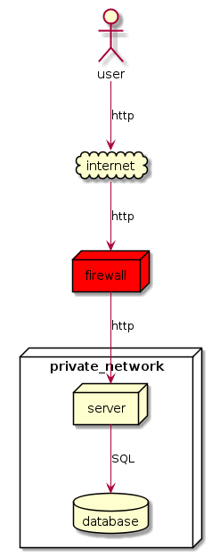

# cornflower

cornflower is a specification for defining architectural diagrams.
It can be exported to [PlantUML](https://plantuml.com/).

What is the advantage of using cornflower?

* You are able gererate different diagrams from the same source by filtering nodes via tags
* You can organize your specifications in multiple files and merge them together

## example

This is a simple example:

```
Cornflower::Model.new do
  user(:shape => :actor)
  
  internet(:shape => :cloud)

  firewall(:style => "red")

  private_network(:shape => :node) do
    server
    database(:shape => :database)

    server() >> database() | :SQL
  end

  user() >> internet() | :http
  internet() >> firewall() | :http
  firewall() >> private_network().server | :http
end
```

Save this file as webapp.cf and generate a PlantUML file:

    cornflower webapp.cf -o webapp.puml

With plantuml you can now generate the diagram:

    plantuml webapp.puml



For more examples see the [examle directory](./example).


## development

### test

start unittests:

    rake test

### build

build project:

    gem build

### install

install project:

    gem install cornflower-X.X.X.gem
